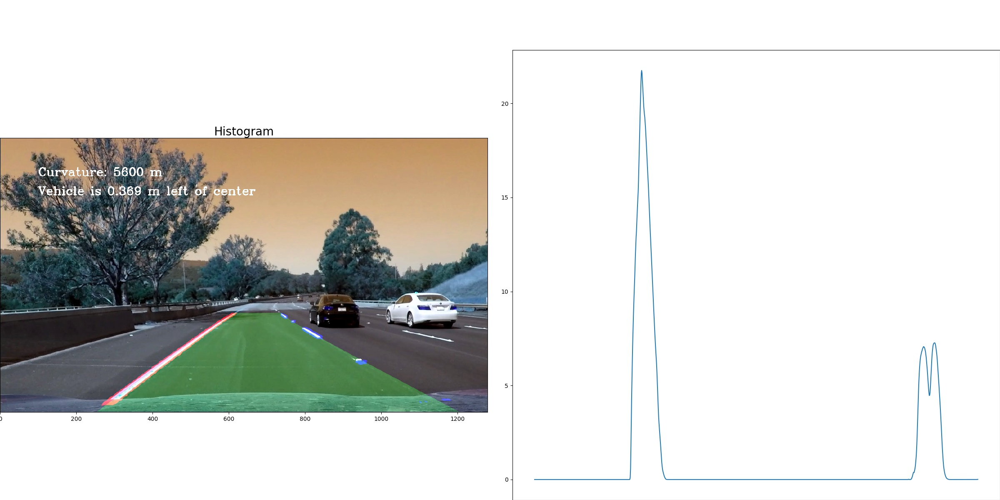

## Advanced Lane Finding

The goals / steps of this project are the following:

* Compute the camera calibration matrix and distortion coefficients given a set of chessboard images.
* Apply a distortion correction to raw images.
* Use color transforms, gradients, etc., to create a thresholded binary image.
* Apply a perspective transform to rectify binary image ("birds-eye view").
* Detect lane pixels and fit to find the lane boundary.
* Determine the curvature of the lane and vehicle position with respect to center.
* Warp the detected lane boundaries back onto the original image.
* Output visual display of the lane boundaries and numerical estimation of lane curvature and vehicle position.

#####################

** Process of the line finding implementation

* Compute the camera calibration matrix and distortion coefficients

* Apply a distortion correction to raw images.

Result of the image with distortion correction applied.

* Use color transforms, gradients, etc., to create a thresholded binary image.

Implement sobel threshold, mag threshold and direction threshold. Combine all the 3 threshold in the project.

Apply crop a region of interest area, remove the noisey area.

* Apply a perspective transform to rectify binary image ("birds-eye view").

warp and unwarp with cv2.getPerspectiveTransform

* Detect lane pixels and fit to find the lane boundary.

- Corner unwarp
- Find lanes with '9' windows used to identify peaks of histograms
- find_lanes function will detect left and right lanes from the warped image.
- Find the historgram from the image inside the window
- Set the direction
- Stable check.
  After calculate the direction, check if the new calculated direction is stable or not. If not stable, calculate from previous result.

- Find the coefficients of polynomials
- Find curvatures

* Determine the curvature of the lane and vehicle position with respect to center.
* Warp the detected lane boundaries back onto the original image.
* Output visual display of the lane boundaries and numerical estimation of lane curvature and vehicle position.

* Video

* Conclusion

The result can be found from the "project_video_processed.mp4". The lanes are identified correctly.

Left lane is more stable than right lane. The curveness calculated by left lanes. The right lane may not stable also when the distance of 2 white line sections are too far from each other.
When the shadow is heavy, the result may not stable as well. We need more preprocessing of the image to improve it.

